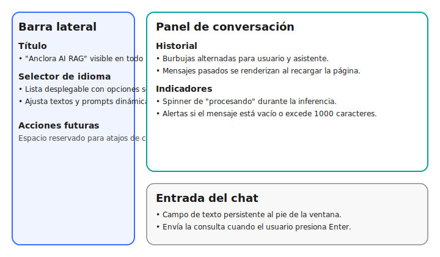

# Anclora AI RAG v1.0

Este repositorio contiene todo lo necesario para poder crear tu propia secretaria hecha con Inteligencia Artificial, todo gracias al RAG de Basdonax AI, que utiliza los modelos open source de Meta y de Microsoft: `Llama3-7b` y `Phi3-4b` para de esta forma darte la posibilidad de subir tus documentos y hacer consultas a los mismos. Esto fue creado para poder facilitarle la vida a las personas con la IA.

## Información del Proyecto

### Resumen

Anclora AI RAG es un sistema de Generación Aumentada por Recuperación (RAG) que permite a los usuarios subir documentos y realizar consultas sobre ellos utilizando modelos de lenguaje de código abierto como Llama3-7b y Phi3-4b. Actualmente la experiencia está optimizada para trabajar en español e inglés, y se ha iniciado un plan de expansión para incorporar más idiomas en próximas versiones. La solución utiliza Docker para la contenerización.

### Estructura

- **app/**: Código principal de la aplicación incluyendo la interfaz de Streamlit, procesamiento de documentos e implementación RAG
- **docs/**: Archivos de documentación del proyecto
- **.vscode/**: Configuración de VS Code
- **docker-compose.yml**: Stack base (CPU) con Ollama, Chroma, UI/API y observabilidad.
- **docker-compose.gpu.yml**: Overlay opcional para habilitar GPU (reservas NVIDIA y diagnóstico con `nvidia-smi`).
- **docker-compose_sin_gpu.yml**: Variante alternativa histórica sin GPU (modelo Phi3).

### Componentes principales del repositorio

- **Interfaz Streamlit (`app/Inicio.py` y `app/pages/`)**: Proporciona el chat principal y la gestión de archivos para la base de conocimiento a través del puerto `8080`. Aquí se orquestan las llamadas al módulo RAG, se gestionan los estados de sesión y se aplican los estilos personalizados.
- **API FastAPI (`app/api_endpoints.py`)**: Expone endpoints REST para integraciones externas en el puerto `8081`, reutilizando la misma lógica de recuperación y generación que la interfaz. Incluye operaciones de consulta, ingesta y administración de documentos.
- **Scripts de arranque (`open_rag.sh` y `open_rag.bat`)**: Automatizan el levantamiento del stack Docker desde distintas plataformas. Solo requieren actualizar la ruta del proyecto antes de ejecutar `docker compose up -d` (aceptan parámetros adicionales como `--profile` o `-f`).

### Lenguaje y Entorno

**Lenguaje**: Python 3.11  
**Framework**: Streamlit  
**Sistema de Construcción**: Docker  
**Gestor de Paquetes**: pip  

### Dependencias

**Dependencias Principales** (Actualizadas a Pydantic v2):

- langchain>=0.2.0
- langchain-community>=0.2.0
- chromadb==0.5.15
- streamlit>=1.28.0
- sentence_transformers
- PyMuPDF==1.23.5
- fastapi>=0.111.0
- uvicorn[standard]
- python-multipart
- pydantic>=2.8.0
- llama-parse>=0.4.0
- ollama (vía Docker)

**Servicios Externos**:

- ChromaDB (base de datos vectorial)
- Ollama (servicio LLM)

#### Modelos de embeddings

El gestor de embeddings permite asignar un modelo diferente por dominio (`documents`, `code`, `multimedia`). Por defecto se
usa `all-MiniLM-L6-v2`, pero puedes personalizarlo mediante variables de entorno o un archivo YAML:

- `EMBEDDINGS_MODEL_NAME`: modelo por defecto aplicado a todos los dominios si no hay overrides.
- `EMBEDDINGS_MODEL_<DOMINIO>`: valor específico por dominio (`EMBEDDINGS_MODEL_CODE`, `EMBEDDINGS_MODEL_MULTIMEDIA`, etc.).
- `EMBEDDINGS_CONFIG_FILE`: ruta a un YAML con la estructura:

```yaml
default_model: sentence-transformers/all-MiniLM-L6-v2
domains:
  documents: sentence-transformers/all-mpnet-base-v2
  code: sentence-transformers/all-mpnet-base-v2
  multimedia: intfloat/multilingual-e5-large
```

Ejemplo de configuración en `docker-compose.yml` asignando modelos distintos:

```yaml
environment:
  - MODEL=llama3
  - EMBEDDINGS_MODEL_NAME=sentence-transformers/all-MiniLM-L6-v2
  - EMBEDDINGS_MODEL_CODE=sentence-transformers/all-mpnet-base-v2
  - EMBEDDINGS_MODEL_MULTIMEDIA=intfloat/multilingual-e5-large
```

Para comparar rápidamente el rendimiento de distintos modelos se incluye el script `scripts/eval_embeddings.py`:

```bash
# Usa los valores definidos en la configuración del gestor
python scripts/eval_embeddings.py

# Compara múltiples modelos en una sola corrida
python scripts/eval_embeddings.py --models sentence-transformers/all-mpnet-base-v2 intfloat/multilingual-e5-large
```

Si cambias el modelo de embeddings o las dependencias relacionadas, recuerda regenerar las imágenes ejecutando `docker compose
build --no-cache` para los servicios `ui` y `api`.

### Docker

**Dockerfile**: app/Dockerfile  
**Imágenes**:

- ollama/ollama:latest (servicio LLM)
- chromadb/chroma:0.5.1.dev111 (Base de datos vectorial)
- nvidia/cuda:12.3.1-base-ubuntu20.04 (solo al combinar con `docker-compose.gpu.yml`)
- Imagen UI/API personalizada construida desde `./app`

**Configuración**:

- Overlay opcional para habilitar GPU cuando se combine `docker-compose.yml` con `docker-compose.gpu.yml`
- Configuración solo CPU disponible para el modelo Phi3
- Volumen persistente para ChromaDB
- Variables de entorno para selección de modelo y configuración de embeddings

#### Variables de entorno para ChromaDB

Los servicios `ui` y `api` consumen ChromaDB mediante las variables de entorno `CHROMA_HOST` y `CHROMA_PORT`, definidas en los archivos `docker-compose*.yml` con los valores por defecto `chroma` y `8000`. Estos valores permiten que ambos servicios descubran automáticamente al contenedor `chroma` cuando el stack se ejecuta con Docker Compose.

Si ejecutas la aplicación fuera de Docker (por ejemplo, para desarrollo local), establece las variables antes de iniciar Streamlit o la API para apuntar al host correspondiente:

```bash
export CHROMA_HOST=localhost
export CHROMA_PORT=8000
streamlit run app/Inicio.py
# o
uvicorn app.api_endpoints:app --reload --port 8081
```

También puedes ajustar `CHROMA_HOST` y `CHROMA_PORT` a los valores de cualquier instancia remota de ChromaDB que quieras reutilizar.

## 🚀 Instalación y Configuración

### Prerrequisitos

- Python 3.11.8 (recomendado)
- Docker y Docker Compose
- Git

### Configuración del Entorno

1. **Clonar el repositorio:**

   ```bash
   git clone https://github.com/ToniIAPro73/basdonax-ai-rag.git
   cd basdonax-ai-rag
   ```

2. **Configurar variables de entorno:**

   ```bash
   cp .env.example .env
   # Editar .env con tus claves API
   ```

3. **Opción A: Usar entorno virtual (Recomendado para desarrollo):**

   ```bash
   # Crear entorno virtual con Python 3.11
   python -m venv venv_rag --python=python3.11

   # Activar entorno virtual (Windows)
   activate_venv.bat

   # Activar entorno virtual (Linux/Mac)
   source venv_rag/bin/activate

   # Instalar dependencias
   pip install -r app/requirements.txt

   # Verificar instalación
   python test_environment.py
   ```

4. **Opción B: Ejecutar con Docker:**

   ```bash
   docker-compose up -d
   ```

### Dependencias Actualizadas

El proyecto ahora utiliza **Pydantic v2** y versiones actualizadas de las dependencias principales:

- **langchain>=0.2.0** (Framework LLM)
- **langchain-community>=0.2.0** (Extensiones de LangChain)
- **pydantic>=2.8.0** (Validación de datos)
- **chromadb==0.5.15** (Base de datos vectorial)
- **llama-parse>=0.4.0** (Procesamiento de documentos complejos en ZIP)
- **fastapi>=0.111.0** (API REST)
- **streamlit>=1.28.0** (Interfaz web)

### Archivos Principales

**Punto de Entrada**: app/Inicio.py
**Módulos Clave**:

- app/common/langchain_module.py: Implementación RAG
- app/common/ingest_file.py: Procesamiento de documentos
- app/common/assistant_prompt.py: Plantilla de prompt para LLM
- app/pages/Archivos.py: Interfaz de gestión de archivos
- app/api_endpoints.py: API REST para agentes y automatizaciones

## Roadmap y contribución

El detalle de fases, épicas y tareas priorizadas se encuentra en el [backlog del roadmap](docs/backlog.md). Allí se listan los módulos involucrados (`app/common/*`, `app/pages/*`, `docker-compose*.yml`, etc.), los criterios de aceptación y las dependencias principales para cada bloque de trabajo. Revísalo antes de abrir issues o Pull Requests para mantener el alineamiento con la hoja de ruta.

### Documentación adicional

- [Guía de Integración / Integration Guide](docs/integration-guide.md): Pasos para consumir la API, usar el cliente Python oficial y conectar agentes (LangChain, AutoGen) con recomendaciones de encoding y manejo de Unicode.

### Configuración de credenciales

Los scripts `open_rag.sh` (Linux/macOS) y `open_rag.bat` (Windows) cargan automáticamente el archivo `.env` si existe. Si no defines `ANCLORA_API_TOKENS` ni `ANCLORA_JWT_SECRET`, se reutilizará el valor de `ANCLORA_DEFAULT_API_TOKEN` y se mostrará una advertencia indicando que se usará el token por defecto. Esto permite levantar la pila rápidamente en entornos locales manteniendo la opción de reforzar la seguridad en producción.

Para inyectar credenciales reales, copia el archivo `.env.example` a `.env` y reemplaza los valores por los de tu entorno:

```bash
cp .env.example .env
# Edita .env y define ANCLORA_API_TOKENS o ANCLORA_JWT_SECRET con tus credenciales.
```

En producción se recomienda definir tus propios tokens o secretos JWT para deshabilitar el token de ejemplo.

### Información legal y cumplimiento

- [Términos y Condiciones de Uso](docs/legal/terms.md): reglas de uso de la plataforma, política de consentimiento y proceso de verificación de derechos antes de cada conversión.
- [Política de Privacidad](docs/legal/privacy.md): tratamiento de datos personales, conservación de evidencias de consentimiento y medidas de seguridad recomendadas.

### Uso

La aplicación se ejecuta en <http://localhost:8080> y la API REST está disponible en <http://localhost:8081>. Desde la UI y la API se ofrece:

- Interfaz de chat para consultar documentos
- Interfaz de carga de archivos para añadir documentos a la base de conocimiento
- Selección de idioma para la interfaz (ver nota más abajo)
- Gestión de documentos (ver y eliminar)
- Endpoints para integraciones externas (consultas, ingestión y listado de archivos)

### Descripción textual de la interfaz principal



- **Barra lateral**: muestra el título de la aplicación y el selector de idioma. Al cambiar la opción se actualizan los textos y prompts en tiempo real.
- **Panel de conversación**: conserva el historial de mensajes del usuario y del asistente, con indicadores de carga mientras se generan las respuestas.
- **Entrada del chat**: campo fijado en la parte inferior que valida mensajes vacíos o con más de 1000 caracteres antes de enviarlos.

### Ejemplos de uso de la API REST

Consulta en español preservando acentos:

```bash
curl -X POST "http://localhost:8081/chat" \
  -H "Authorization: Bearer your-api-key-here" \
  -H "Content-Type: application/json" \
  -d '{
        "message": "¿Cuál es el estado del informe trimestral?",
        "language": "es",
        "max_length": 600
      }'
```

Consulta en inglés con caracteres ñ/á:

```bash
curl -X POST "http://localhost:8081/chat" \
  -H "Authorization: Bearer your-api-key-here" \
  -H "Content-Type: application/json" \
  -d '{
        "message": "Please summarize the jalapeño market update on Día 1",
        "language": "en",
        "max_length": 600
      }'
```

Carga de archivos desde la terminal:

```bash
curl -X POST "http://localhost:8081/upload" \
  -H "Authorization: Bearer your-api-key-here" \
  -F "file=@revisión_técnica.pdf"
```

## Requisitos previos

- Docker o Docker desktop: <https://www.docker.com/products/docker-desktop/>
- **(opcional)** Tarjeta gráfica RTX

## Instalación

### Elección del modelo de datos (LLM)

Antes de comenzar con la instalación, define si ejecutarás el stack solo con CPU o si habilitarás GPU. El archivo base `docker-compose.yml` funciona en ambos escenarios (por defecto el servicio `ollama` expone el modelo `llama3`, que también puede ejecutarse en CPU). Si prefieres un modelo más liviano puedes reutilizar la variante `docker-compose_sin_gpu.yml` (modelo `phi3`).

- **Solo CPU:** `docker compose up -d` levanta `ollama`, `chroma`, `ui`, `api`, Prometheus y Grafana.
- **Con GPU NVIDIA:** combina los archivos ejecutando `docker compose -f docker-compose.yml -f docker-compose.gpu.yml up -d`. El segundo archivo agrega las reservas de GPU y un contenedor auxiliar (`gpu-diagnostics`) que ejecuta `nvidia-smi` para validar el acceso a la tarjeta.

#### Docker Installation

Tenemos que tener Docker o Docker Desktop instalado, te recomiendo ver este video para instalar todo: <https://www.youtube.com/watch?v=ZyBBv1JmnWQ>

Una vez instalado y prendido el Docker Desktop si lo estamos utilizando, vamos a ejecutar en esta misma carpeta:

```bash
docker compose up
```

La primera vez vamos a tener que esperar a que todo se instale correctamente, va a tardar unos cuantos minutos en ese paso.

Ahora tenemos que instalarnos nuestro modelo LLM, si tenemos una GPU que pueda soportar vamos a ejecutar el comando para traernos Llama3, sino va a ser Phi3 (si queremos utilizar otro modelo, en esta pagina: <https://ollama.com/library> tenes la lista de todos los modelos open source posibles en esta página, recorda que seguramente vayas a tener que hacer cambios en la prompt si cambias el modelo), ejecutamos:

```bash
docker ps
```

Te va a aparecer algo como esto:

```text
CONTAINER ID   IMAGE                    COMMAND                  CREATED              STATUS              PORTS                    NAMES
696d2e45ce7c   ui                       "/bin/sh -c 'streaml…"   About a minute ago   Up About a minute   0.0.0.0:8080->8080/tcp   ui-1
28cf32abee50   ollama/ollama:latest     "/bin/ollama serve"      About a minute ago   Up About a minute   11434/tcp                ollama-1
ec09714c3c86   chromadb/chroma:latest   "/docker_entrypoint.…"   About a minute ago   Up About a minute   0.0.0.0:8000->8000/tcp   chroma-1
```

En esta parte tenés que copiar el `CONTAINER ID` de la imagen llamada `ollama/ollama:latest` y utilizarla para este comando:

```bash
docker exec [CONTAINER ID] ollama pull [nombredelmodelo]
```

Un ejemplo con `Llama3-7b` y mi `CONTAINER ID`

```bash
docker exec 28cf32abee50 ollama pull llama3
```

Un ejemplo con `Phi3-4b` y mi `CONTAINER ID`

```bash
docker exec 28cf32abee50 ollama pull phi3
```

Ahora vamos a tener que esperar a que se descargue el modelo, una vez hecho esto solo nos queda modificar la prompt:

Esto se va a hacer a nuestro gusto en el archivo `./app/common/assistant_prompt.py`.

Una vez hecho todo lo anterior solo queda un paso: que entremos al siguiente link: <http://localhost:8080> para poder utilizar el RAG.

## Pruebas automatizadas

Ejecuta la batería de pruebas localmente con:

```bash
pytest
```

Para correr únicamente la nueva suite de regresión que valida los flujos del asistente utiliza:

```bash
pytest tests/regression
```

## Selección de idioma

Actualmente la interfaz y las respuestas del asistente están validadas para español (por defecto) e inglés. Puedes alternar entre ambos idiomas desde el selector de la barra lateral, y la preferencia se mantendrá durante toda la sesión.

### Roadmap de soporte multilingüe

El equipo está trabajando para ampliar progresivamente la cobertura lingüística:

1. **Portugués**: previsto para la siguiente iteración, incluyendo traducciones de UI y prompts especializados.
2. **Francés y Alemán**: planeados tras estabilizar portugués, con validación de métricas de calidad antes de lanzamiento.
3. **Otros idiomas**: se evaluarán según demanda, priorizando documentación y prompts específicos para cada caso.

## ¿Como ejecutarlo posteriormente instalado y una vez lo cerremos?

Tenemos que dejarnos en el escritorio el archivo de `open_rag.bat` si estamos en Windows y si estamos en Mac/Linux el `open_rag.sh`

Ahora tenemos que abrirlo y modificarlo, tenemos que agregar la ruta donde hicimos/tenemos el `docker-compose.yml`, por ejemplo mi ruta es:

```text
C:\Users\fcore\OneDrive\Desktop\Basdonax\basdonax-rag>
```

> 💡 Consulta la [guía detallada en `docs/guia_open_rag.md`](docs/guia_open_rag.md) para revisar prerrequisitos, pasos de ejecución y soluciones a errores comunes al usar `open_rag.sh` y `open_rag.bat`.

Entonces en mi caso va a ser así el `open_rag.bat` (el .sh es lo mismo):

```batch
cd C:\Users\fcore\OneDrive\Desktop\Basdonax\basdonax-rag
docker compose up -d
```

Si necesitas habilitar GPU desde estos scripts, agrega los archivos adicionales antes del comando `up`, por ejemplo:

```batch
docker compose -f docker-compose.yml -f docker-compose.gpu.yml up -d
```

Ahora mientras que tengamos el Docker/Docker Desktop prendido y mientras que ejecutemos este archivo vamos a poder acceder al RAG en este link: <http://localhost:8501>

Próximo paso: disfrutar
